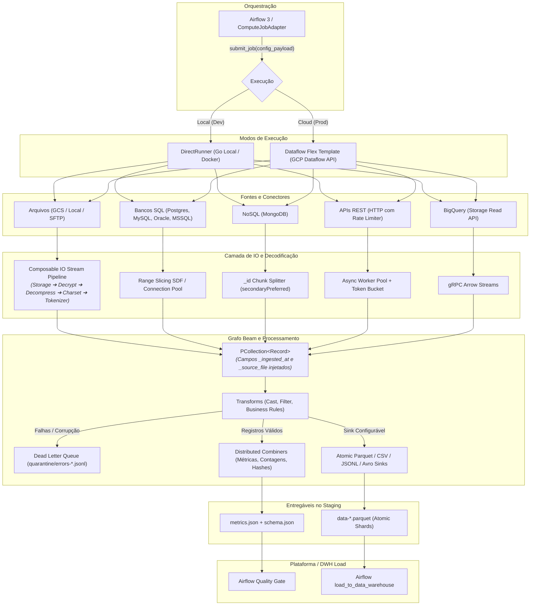

# Especificação Arquitetural e de Requisitos — Motor de Compute Dataflow (Go / Apache Beam)
**Versão:** 2.0  
**Data:** 2026-08-14  
**Status:** Aprovado  

---

## 1. Visão Geral e Arquitetura do Sistema

O motor de compute em **GoLang com Apache Beam** é o componente de alta performance da plataforma de dados responsável por executar pipelines de **Ingestão**, **Transformação (ETL)** e **Exportação (Reverse-ETL)**. 

Ele foi desenhado sob os princípios de **Clean Architecture (Ports & Adapters)** para operar em dois ambientes com o mesmo código-fonte:
1. **Ambiente Local (Desenvolvimento / Testes):** Executado diretamente via `DirectRunner` (processo local ou container Docker) sem necessidade de assinatura, credenciais ou custos na GCP.
2. **Ambiente de Produção (Google Cloud Dataflow):** Executado como um **Dataflow Flex Template** na GCP, aproveitando auto-scaling horizontal, Dynamic Work Rebalancing e alta escalabilidade.



---

## 2. Composable IO Stream Pipeline (Decodificação Modular de Arquivos)

Para permitir que recursos como **PGP**, **Compressão/Descompressão**, **Normalização de Charset/Encoding** e **Formatos de Arquivo** sejam combinados livremente sem duplicação de código, implementamos o padrão **Composable IO Pipeline** baseado em encadeamento simétrico de `io.Reader` (Ingestão) e `io.Writer` (Exportação).

```
┌─────────────────────────────────────────────────────────────────────────────────────────┐
│                           COMPOSABLE IO INGESTION PIPELINE                              │
│                                                                                         │
│  [ Raw Storage Reader ]  ──► GCS / Local / SFTP (io.Reader)                             │
│           │                                                                             │
│           ▼                                                                             │
│  [ Decryption Layer ]    ──► PGP / GPG / AES / None (io.Reader)                         │
│           │                                                                             │
│           ▼                                                                             │
│  [ Decompression Layer ] ──► Gzip / Bzip2 / Zstd / Snappy / Zip / None (io.Reader)      │
│           │                                                                             │
│           ▼                                                                             │
│  [ Charset Normalizer ]  ──► UTF-8, ISO-8859-1 (Latin1), Windows-1252 (io.Reader)       │
│           │                                                                             │
│           ▼                                                                             │
│  [ Format Tokenizer ]    ──► CSV / Fixed-Width / JSON Array / XML Stream                │
│           │                                                                             │
│           ▼                                                                             │
│  [ Audit Enricher ]      ──► Injeta _ingested_at (UTC) e _source_file                   │
│           │                                                                             │
│           ▼                                                                             │
│  [ Beam PCollection ]    ──► Emite Record para processamento distribuído                │
└─────────────────────────────────────────────────────────────────────────────────────────┘
```

### 2.1. Regras de Metadados e Auditoria
- **Ingestão de Arquivos:** O pipeline injeta automaticamente os campos de auditoria em cada registro:
  - `_ingested_at`: Timestamp UTC ISO8601 (`RFC3339` / `TIMESTAMP_MICROS`).
  - `_source_file`: Caminho completo ou nome do arquivo de origem (ex: `gs://landing/faturas/2026/08/fat_001.xml.pgp`).
- **Exportação de Dados:** **Nenhum** campo de auditoria é injetado, preservando estritamente o layout e schema solicitado pelo sistema de destino.

### 2.2. Encodings e Delimitadores Suportados
- **Charsets:** UTF-8 (padrão), ISO-8859-1 (Latin-1), Windows-1252, UTF-16LE, UTF-16BE (via pacote `golang.org/x/text/encoding`).
- **Delimitadores CSV:** Vírgula (`,`), Ponto e Vírgula (`;`), Pipe (`|`), Tab (`\t`), com escape e quote chars configuráveis.
- **Fixed-Width (Posicional):** Definição de layout baseada em ranges de colunas `[start, end, name, type]`.

---

## 3. Conectores de Origem e Estratégias de Paralelização

### 3.1. Bancos Relacionais (SQL) — Drivers Nativos em Go
- **Drivers Utilizados:**
  - **PostgreSQL:** `github.com/jackc/pgx/v5` (alta performance, suporte nativo a tipos binários).
  - **MySQL / MariaDB:** `github.com/go-sql-driver/mysql`.
  - **Oracle Database:** `github.com/godror/godror` (ou driver pure-Go).
  - **Microsoft SQL Server:** `github.com/microsoft/go-mssqldb`.
- **Estratégia de Particionamento (Range Slicing SDF):**
  - O pipeline faz uma query de split bounds (`SELECT MIN(col), MAX(col), COUNT(*) FROM table WHERE [filter]`).
  - Divide o intervalo em $N$ fatias (`WHERE col >= slice_min AND col < slice_max`).
  - Cada worker executa sua fatia em paralelo com controle rigoroso de pool (`MaxOpenConns: 4`, `MaxIdleConns: 2` por worker) para não sobrecarregar o banco fonte.

### 3.2. NoSQL — MongoDB
- **Driver Utilizado:** `go.mongodb.org/mongo-driver/v2`.
- **Estratégia de Extração:**
  - Leitura direcionada a nós secundários (`ReadPreference = SecondaryPreferred`).
  - Particionamento por intervalos de `_id` (ObjectId ranges ou amostragem por `$bucketAuto`).
  - Conversão fluida de documentos BSON para registros normalizados (Generic Record / Arrow Table).

### 3.3. APIs REST (HTTP Ingestion)
- **Cliente:** `net/http` com `http.Transport` otimizado (keep-alive, connection pooling).
- **Controle de Vazão (Rate Limiting):**
  - Implementação de **Token Bucket** em Go (`golang.org/x/time/rate`) por domínio/endpoint para respeitar limites do provedor da API.
  - Worker Pool assíncrono para paginações (`offset_limit`, `page_number`, `cursor`, `header_link`).
  - Retentativas com *exponential backoff* e jitter para status `429`, `500`, `502`, `503`, `504`.

### 3.4. BigQuery (Exportação / Reverse-ETL)
- **Leitura:** **BigQuery Storage Read API** (gRPC streams paralelos) lendo diretamente blocos colunares (Arrow/Avro) da camada de armazenamento do BigQuery.
- Suporta pushdown de projeção de colunas (`selected_fields`) e predicados SQL (`row_restriction`).

---

## 4. Chunking, Splittable DoFns (SDF) e Dynamic Work Rebalancing

Para maximizar a escalabilidade e o balanceamento de carga sem criar gargalos em arquivos grandes, adotamos o modelo de **3 Famílias Ortogonais de SDF**:

| Família de Ingestão (SDF) | Mecanismo de Fatiamento | Tracker do Apache Beam | Suporte a Dynamic Work Rebalancing? |
|---|---|---|---|
| **1. ByteStream Family (`ByteStreamSourceSDF`)** | Bounded byte offsets `[Start, End)` com detecção dinâmica de `\n` | `ByteOffsetTracker` | ✅ **Sim (Total)** — Dataflow rebalanceia chunks de arquivos continuamente. |
| **2. PartitionQuery Family (`PartitionQuerySourceSDF`)** | Fatias discretas `PartitionSlice{SliceIndex, Bounds}` | `PartitionRangeTracker` | ✅ **Sim (Total)** — Workers dividem e processam fatias de consultas concorrentemente. |
| **3. PagedAPI Family (`PagedAPISourceSDF`)** | Páginas discretas e tokens de cursor `PageSlice{PageIndex, Cursor}` | `PageRangeTracker` | ✅ **Sim (Total)** — Paginação dinâmica de endpoints REST/GraphQL. |

---

## 5. Garantia de Não-Perda (Zero Data Loss) e Não-Duplicação

A plataforma e o motor em Go operam com uma arquitetura de integridade estrita:

```
                  ┌────────────────────────────────────────────────────────┐
                  │                 TOTAL DE REGISTROS LIDOS               │
                  │                 (Input Records Scanned)                │
                  └───────────────────────────┬────────────────────────────┘
                                              │
                     ┌────────────────────────┴────────────────────────┐
                     ▼                                                 ▼
      ┌─────────────────────────────┐                   ┌─────────────────────────────┐
      │   REGISTROS VÁLIDOS ESCRITOS │                   │ REGISTROS EM QUARENTENA     │
      │   (rows_written)             │                   │ (dead_letter_count)         │
      │   ──► data-*.parquet         │                   │ ──► quarantine/errors-*.jsonl│
      └──────────────┬──────────────┘                   └──────────────┬──────────────┘
                     └────────────────────────┬────────────────────────┘
                                              ▼
                             ┌──────────────────────────────────┐
                             │       CONSERVAÇÃO ESTRITA:       │
                             │ total == rows_written + dlq_count│
                             └──────────────────────────────────┘
```

1. **Atomicidade de Escrita (Zero Arquivos Duplicados ou Parciais):**
   - O Apache Beam escreve em arquivos temporários ocultos (`.temp-...`). Somente no sucesso atômico do bundle e do job os arquivos são renomeados para o nome final (`data-*.parquet`). Falhas de worker descartam arquivos temporários sem deixar lixo no staging.
2. **Conservação Estrita de Volume:**
   - Todo registro lido da origem é obrigatoriamente contabilizado em `rows_written` ou em `dead_letter_count`.
   - O `metrics.json` consolida esses números para que os Quality Gates do Airflow validem a integridade antes da carga no Data Warehouse.
3. **Deduplicação Opcional em Grafo:**
   - Caso a fonte possua registros duplicados ou sobreposição de partições, o pipeline oferece a transformação `beam.Distinct` ou `CombinePerKey` baseada na chave primária ou no hash da linha.
4. **Fronteira Clara de Responsabilidade:**
   - O Dataflow é responsável por entregar arquivos de staging atômicos, limpos e com metadados auditados (`metrics.json` e `schema.json`).
   - A carga no Data Warehouse (BigQuery) e a verificação pós-carga continuam sendo de responsabilidade das tasks padronizadas do Airflow (`load_to_data_warehouse` e `post_load_validation`).

---

## 6. Estratégia de Deploy e Flex Template

Adotamos a estratégia de **Template Único Unificado com Sub-Grafos Especializados**:
- Um **único binário em Go** (< 40MB) compilado em imagem Docker Alpine/Distroless.
- Um **único Flex Template** registrado no Artifact Registry / GCS.
- O ponto de entrada (`main.go`) lê o `--config_payload` e instancia **apenas o grafo do Beam necessário** via `BeamSourceBuilder` (`FileBeamSource`, `PartitionedBeamSource`, `PagedAPIBeamSource` ou `SQLBeamSource`).
- **Vantagens:** CI/CD unificado, zero drift de versão entre conectores, inicialização ultrarrápida do worker do Dataflow (< 15 segundos).

---

## 7. Estrutura Completa do Projeto em Go (Clean Architecture)

```
dataflow-compute-go/
├── cmd/
│   └── pipeline/
│       └── main.go                 # Entrypoint, leitura de flags (--config_payload, --runner) e Composition Root
├── internal/
│   ├── domain/                     # Entidades de Domínio e Regras Puras (sem dependência de Beam)
│   │   ├── config.go               # Structs de configuração do manifesto (Source, Sink, Quality, DLQ)
│   │   ├── record.go               # Modelo dinâmico de registro (Generic Record / Arrow Row)
│   │   ├── schema.go               # Definições de tipos, colunas e validações
│   │   └── metrics.go              # Estrutura do metrics.json e acumuladores
│   ├── ports/                      # Interfaces e Contratos
│   │   ├── decoder.go              # Interface StreamDecoder
│   │   ├── encoder.go              # Interface RecordWriter (Parquet, CSV, DLQ, Metadata)
│   │   ├── extractor.go            # Interface polymorphic RecordExtractor
│   │   ├── partition.go            # Interface PartitionedReader e struct PartitionSlice
│   │   ├── paged_api.go            # Interface PagedAPIReader e struct PageSlice
│   │   ├── sql_source.go           # Interface SQLReader e type alias SQLSlice = PartitionSlice
│   │   ├── storage.go              # Interface StorageReader / StorageWriter / StorageBackend
│   │   ├── middleware.go           # Interface StreamWrapper
│   │   └── secret_resolver.go      # Interface SecretResolver (Vault / GCP Secret Manager)
│   ├── adapters/                   # Adaptadores de Infraestrutura e IO
│   │   ├── io_pipeline/            # Construtor do Composable IO Pipeline (Decompress -> Charset -> Parser)
│   │   ├── sources/                # Adaptadores de leitura (SQL, Mongo, APIs)
│   │   │   └── sql/                # GenericSQLSource (Postgres, MySQL) com Range Slicing
│   │   ├── sinks/                  # Sinks polimórficos (ParquetSink, DLQSink, MetadataSink)
│   │   ├── storage/                # LocalStorage e GCSStorage
│   │   ├── secrets/                # OpenBaoResolver e GCPSecretManagerResolver
│   │   └── telemetry/              # OpenTelemetry Tracers e Spans
│   └── beam/                       # Grafos e Transformações Apache Beam Go
│       ├── orchestrator.go         # IngestionOrchestrator unificado síncrono
│       ├── file_extractor.go       # FileSourceExtractor (implements RecordExtractor)
│       ├── sql_extractor.go        # SQLSourceExtractor (implements RecordExtractor)
│       ├── graph_builder.go        # Universal BuildPipeline e BeamSourceBuilder
│       ├── transforms/             # DoFns (AuditEnricherFn, CastAndValidateFn, ParquetSinkDoFn, DLQSinkDoFn)
│       └── sdf/                    # Famílias de Splittable DoFn e Restriction Trackers
│           ├── byte_offset_tracker.go      # RestrictionTracker de byte-offsets
│           ├── file_source_sdf.go          # ByteStreamSourceSDF para arquivos
│           ├── partition_range_tracker.go  # RestrictionTracker de fatias discretas
│           ├── partition_query_source_sdf.go # PartitionQuerySourceSDF para RDBMS/NoSQL
│           ├── page_range_tracker.go       # RestrictionTracker de páginas e cursores
│           └── paged_api_source_sdf.go     # PagedAPISourceSDF para APIs
├── Dockerfile                      # Multi-stage build para Flex Template e Execução Local
├── Makefile                        # Comandos de lint, testes unitários e execução local
└── go.mod
```

---

## 8. Contrato Completo do Manifesto JSON (`--config_payload`)

```json
{
  "pipeline_id": "9b1deb4d-3b7d-4bad-9bdd-2b0d7b3dcb6d",
  "run_id": "run_20260814_140000",
  "pipeline_type": "ingestion",
  "runner": "direct",
  "source": {
    "type": "database",
    "endpoint": {
      "type": "postgres",
      "host": "postgres-prod.internal",
      "port": 5432,
      "database": "vendas_db",
      "credential_ref": "vault:secret/data/db/vendas#creds"
    },
    "table": "pedidos",
    "partition_column": "id",
    "partition_type": "numeric_range",
    "num_partitions": 8,
    "filter_query": "status = 'CONCLUIDO'",
    "schema": [
      {"name": "id", "type": "int64", "nullable": false},
      {"name": "cliente_id", "type": "string", "nullable": false},
      {"name": "valor_total", "type": "decimal", "scale": 2, "on_overflow": "round", "nullable": false},
      {"name": "data_pedido", "type": "timestamp", "nullable": false}
    ]
  },
  "resilience": {
    "max_failures": 5,
    "circuit_breaker_timeout_ms": 10000,
    "half_open_limit": 3
  },
  "destination": {
    "type": "staging_storage",
    "output_format": "parquet",
    "output_path": "gs://bucket-staging/pedidos/run_20260814_140000/",
    "compression": "snappy",
    "target_file_size_mb": 256,
    "include_audit_columns": true
  },
  "quality_rules": [
    {"type": "row_count_min", "value": 1},
    {"type": "not_null", "column": "id"},
    {"type": "unique", "column": "id"}
  ],
  "dlq_config": {
    "enabled": true,
    "quarantine_path": "gs://bucket-staging/pedidos/run_20260814_140000/quarantine/",
    "max_error_percentage": 1.0
  }
}
```

---

## 9. Matriz Consolidada de Requisitos

| ID | Categoria | Requisito | Detalhes da Implementação |
|---|---|---|---|
| **RF-01** | Ingestão | Conectores SQL Nativos | Drivers puros Go (`pgx`, `mysql`, `godror`, `mssql`) com particionamento por Range Slicing e Connection Pooling. |
| **RF-02** | Ingestão | Conector MongoDB | Driver oficial Go com leitura em nós secundários (`secondaryPreferred`) e divisão por chunks de `_id`. |
| **RF-03** | Ingestão | Conector REST API | Worker Pool assíncrono com Token Bucket Rate Limiter e paginação configurável. |
| **RF-04** | Ingestão | Composable IO Pipeline | Encadeamento modular de Storage ➔ Decriptação (PGP) ➔ Descompressão (Gzip/Zstd/Zip) ➔ Charsets ➔ Formato. |
| **RF-05** | Auditoria | Colunas de Auditoria | Injeção obrigatória de `_ingested_at` e `_source_file` na ingestão de arquivos (sem injeção na exportação). |
| **RF-06** | Escalabilidade | Splittable DoFn (SDF) | SDFs com `OffsetRangeTracker` para arquivos planos e SQL; Micro-batch Reshuffling para streams não-fatiáveis. |
| **RF-07** | Integridade | Zero Data Loss (Não-Perda) | Conservação estrita de registros: `total_lido == rows_written + dead_letter_count`. |
| **RF-08** | Integridade | Dead Letter Queue (DLQ) | Desvio de registros corrompidos/inválidos para `quarantine/errors-*.jsonl` via Side Output do Beam. |
| **RF-09** | Governança | Geração de Metadados | Emissão atômica de `metrics.json` (estatísticas de colunas/linhas) e `schema.json` (esquema técnico). |
| **RF-10** | Exportação | BigQuery Storage Read API | Extração colunar de alta performance via gRPC com serialização em CSV, JSONL, Parquet ou XML. |
| **RNF-01** | Portabilidade | Dual Runner (Direct / Dataflow) | Mesmo código roda localmente sem GCP ou em nuvem como Dataflow Flex Template. |
| **RNF-02** | Deploy | Template Único Unificado | Um único binário e imagem de container gerenciando todos os tipos de workloads via sub-grafos. |
| **RNF-03** | Performance | Zero-Allocation Buffer Pool | Uso de `sync.Pool` para buffers de stream e serialização, minimizando pausas de Garbage Collector. |
| **RNF-04** | Observabilidade | Structured JSON Logging | Logs em formato JSON (`log/slog`) contendo `pipeline_id`, `run_id` e métricas de execução no stdout. |
| **RNF-05** | Segurança | Resolução Dinâmica de Segredos | Resolução em tempo de execução de chaves PGP e senhas de banco via OpenBao/Vault ou Secret Manager. |

---

## 10. Decisão Arquitetural: Limites e Fronteiras de Polimorfismo

Para manter a simplicidade, legibilidade e manutenibilidade do código em Go (evitando complexidade acidental e sobre-engenharia de interfaces), foram estabelecidas as seguintes fronteiras:

### 10.1. Polimorfismos Mantidos no Core (Explicit Interfaces):
1. **`StreamDecoder` / `SourceAdapter`:** Abstração de entrada para leitura de Arquivos, SQL, MongoDB, APIs REST e BigQuery.
2. **`StreamEncoder` / `SinkAdapter`:** Abstração de saída para escrita atômica em Parquet, CSV, JSONL e Avro.
3. **`StreamMiddleware`:** Encadeamento componível de `io.Reader` e `io.Writer` (Decriptação, Descompressão e Normalização de Charset).

### 10.2. Variações Resolvidas Declarativamente no Manifesto JSON (Sem Interfaces Adicionais):
- **Estratégias de Carga Incremental / Watermarking:** Configurações declarativas no bloco `source` (ex: `filter_query: "updated_at > '{{ last_watermark }}'"` ou `partition_column: "id"`), manipuladas diretamente pelos adaptadores de banco sem exigir hierarquia polimórfica de classes.
- **Autenticação:** Resolvida na borda pelo `SecretResolver` com injeção de parâmetros nos clientes nativos (Postgres, Mongo, HTTP headers), mantendo os conectores limpos.
- **Destinos de Exportação Específicos (SFTP, Webhook):** Conduzidos por configurações de destino (`destination.type`) no próprio manifesto, sem proliferar interfaces desnecessárias no core do domínio.

